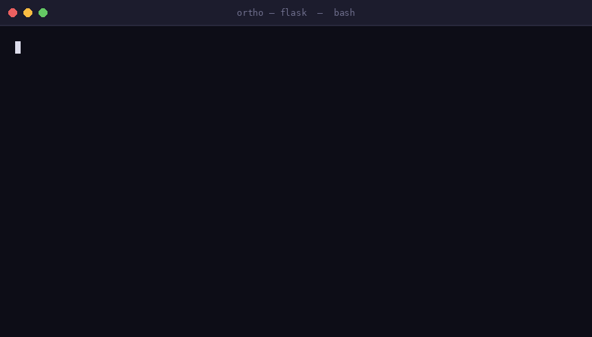

# Ortho — Engineering Decision Engine

> **AI coding assistants write code. They have no idea what your architecture is.**

Ortho is a local-first engineering intelligence tool that scans your Python repo, understands its architecture, and catches violations before they merge — so your AI assistant stops breaking things downstream.

**→ [Start in 2 minutes](ONBOARD.md) ← NEW USERS START HERE**

---



---

## The Problem

AI coding tools (Copilot, Claude Code, Cursor) are great at writing code. They'll suggest adding a database call from a router layer, import a service from a utility module, or introduce a circular dependency across three packages — all in code that looks perfectly reasonable until it breaks something downstream.

And because the AI has no memory of past decisions, it'll suggest the same pattern again next sprint.

---

## What Ortho Does

**1. Scans your repo** — builds a call graph, import graph, symbol index, and architecture model from your actual code. Takes ~10–30 seconds for 1,000 files.

**2. Finds real violations** — layer boundary violations, circular dependency chains, bloat and coupling hotspots. Every finding cites real, checkable evidence: the actual import edge, the actual cycle chain, the actual line.

**3. Remembers what you rejected** — when you flag a finding as a false positive, Ortho stores that. Next scan: *"Rejected 2026-07-10: violates service boundary. Reason: intentional shortcut pending refactor."*

---

## Install

**Windows (PowerShell):**
```powershell
irm https://adithyak3106.github.io/Ortho-community/install.ps1 | iex
```

**macOS / Linux:**
```bash
git clone https://github.com/AdithyaK3106/Ortho.git && cd Ortho && ./install.sh
```

Prerequisites: `git`, `python`, `pip`, `node`, `npm`

---

## Quick Start

```bash
cd your-repo
ortho init          # scan and index your repo
ortho guardrails    # find layer-boundary violations
ortho decide "add Redis caching to the API layer"   # decision support
ortho ask "which modules own authentication?"       # repo Q&A
```

---

## CLI Commands

| Command | What it does |
|---|---|
| `ortho init` / `ortho scan` | Bootstrap and index your repo |
| `ortho guardrails [path]` | Detect layer-boundary violations |
| `ortho analyze [--impact\|--debt\|--deps]` | Architecture reports |
| `ortho decide <intent>` | Multi-source decision support |
| `ortho plan <intent>` | Feature implementation paths |
| `ortho refactor [path]` | Bloat, coupling, and cycle findings |
| `ortho ask <question>` | Repository Q&A |
| `ortho feedback` | Accept/reject findings — builds memory |
| `ortho memory search <query>` | Search past workflow artifacts |
| `ortho cross-repo` | Cross-repository intelligence |
| `ortho run <intent>` | Run the ASES multi-agent workflow (PLANNER → ARCHITECT → CODER → REVIEWER) with real approval gates. Set `ORTHO_LLM_API_KEY` for real agent output; falls back to a clearly-marked stub otherwise. |
| `ortho status` / `approve` / `reject` | Inspect, approve, or reject an in-progress workflow run |

---

## MCP Server

Ortho ships a 10-tool MCP server. Connect it to Claude, Cursor, or any MCP-compatible assistant and your AI gets architecture context before generating code.

```json
{
  "mcpServers": {
    "ortho": {
      "command": "node",
      "args": ["path/to/ortho/apps/mcp-server/dist/index.js"]
    }
  }
}
```

---

## Why Local-First?

Most teams I've talked to can't send source to a third-party cloud — SOC2 scope, HIPAA, FedRAMP, contractual IP clauses. CodeRabbit, Greptile, and Qodo are cloud-based, so they're structurally off the table before a feature comparison starts.

Ortho runs entirely from your machine. The only file it writes is `.ortho/ortho.db` — a SQLite database in your repo root. No source leaves your machine. No auth, no cloud, no setup beyond the installer.

---

## Current State

- **1,198 tests** — 1,198 passing, across 7 packages (cli-commands, repo-intelligence, context-hub, decision-engine, orchestration, token-optimizer, apps/cli)
- **False-positive audit** — 9 real repos (click, flask, requests, django, celery + internal); 91% → 0% FP rate on real architecture violations
- **mypy --strict** — clean on all 19 actively-touched source files, verified together
- **10 MCP tools** — verified end-to-end via real stdio round-trip, benchmarked live against raw Claude Code on Flask, Django, and SQLAlchemy
- **ASES multi-agent workflow** (`ortho run`) — real, working state machine with real approval gates; now wired to a live LLM with real read-only repo tools (read_file, search_symbols, run_guardrails, and more), verified end-to-end on a real refactor task
- **Python primary** (tree-sitter AST, Python 3.8–3.13); TypeScript secondary

**Known limitations:**
- The redesigned layer-boundary checker is validated on synthetic fixtures; not yet observed firing on a real production violation in the wild. That's what pilot users are for.
- Impact analysis undercounts blast radius through indirect coupling (e.g. shared global state) — a manual code read currently catches more than the automated check.
- `cross-repo`'s similarity search has an O(n²) guard that fails fast on large repos, but hasn't yet produced a confirmed true positive in benchmark testing at file-pair scope.
- The ASES workflow's tool-execution loop is capped at 10 real round-trips per step — enough for architecture planning, not always enough for a full multi-file coding task.

---

## Looking for Pilots

5 engineering teams to run Ortho on a real internal repo for 30 days and give honest feedback.

If you're already shipping AI-generated code and have hit the "but it broke the architecture" problem — [reach out](mailto:urbrain369@gmail.com).

---

## Links

- [ONBOARD.md](ONBOARD.md) — 2-minute quickstart
- [PILOT_READINESS.md](PILOT_READINESS.md) — pilot program details
- [GitHub](https://github.com/AdithyaK3106/Ortho)
- urbrain369@gmail.com
